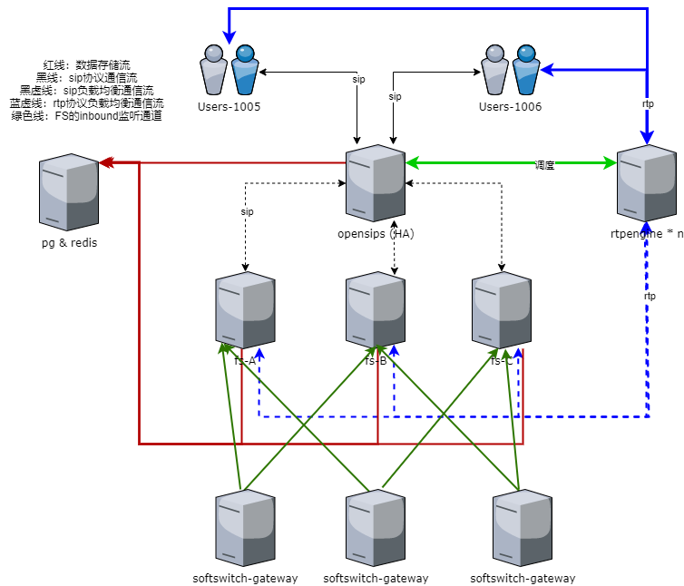

# SoftSwitch-Gateway : Opensips And FreeSWITCH For In One

Based on netty 4 docking Opensips Exported Event, Exported MI and Freeswitch Event Socket Library, cdr, xml_curl and other interface implementation solutions

## Target

    1. Support to connect to Opensips MI and events
    2. Support connection to FreeSWITCH ESL (inbound, outbound), cdr, xml_curl (configuration(ivr)|directory|dial plan|phrase)
    3. Easier to use integrated solutions
    4. Integrate with spring boot 2.3.x, nacos configuration center, service discovery
    5. Can be dynamically configured

---

## Illustrate

### 1.[deployment plan](doc) 

* [opensips-fs-tandem](doc/DeploymentPlan1.md)
* [opensips-register-fs](doc/DeploymentPlan3.md)
* [opensips-fs-rtpengine](doc/DeploymentPlan4.md) (recommend)

### 2.[freeswitch-esl、freeswitch-cdr](https://github.com/zhouhailin)

    参考 https://github.com/zhouhailin/freeswitch-esl-all
    参考 https://github.com/zhouhailin/freeswitch-cdr-all
    参考 https://github.com/zhouhailin/spring-boot-common

### 3.HA Topology Diagram

---

## 志同道合(钉钉) - 请备注来源

## License

[Apache License, Version 2.0](http://www.apache.org/licenses/LICENSE-2.0.html) Copyright (C) Apache Software Foundation
