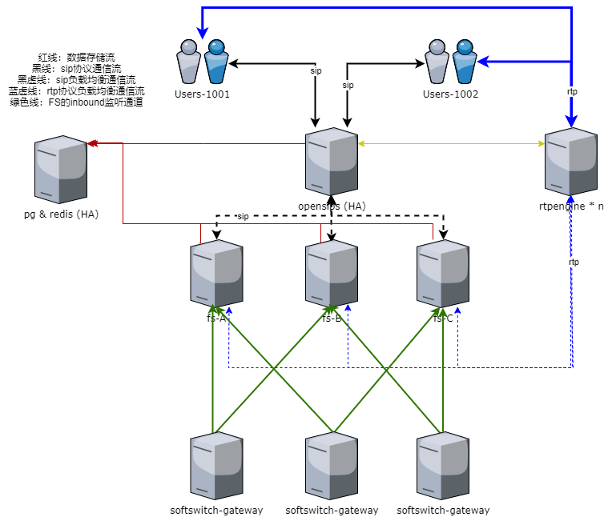

# Opensips And FreeSWITCH For In One

## 目标

    1、支持连接Opensips MI、 Event
    2、支持连接FreeSWITCH ESL(inbound、outbound)、cdr、xml_curl(configuration | directory | dialplan | phrases)
    3、更易于分布式集成方案使用
    4、与spring boot 2.3.x 整合，nacos 配置中心、服务发现
    5、可动态配置

## 模块说明

### 1.[deployment plan](doc)

* [opensips-fs-rtpengine](doc/DeploymentPlan4.md)
* [opensips-register-fs](doc/DeploymentPlan3.md)

### 2.[freeswitch-esl、freeswitch-cdr](https://github.com/zhouhailin)

    参考 https://github.com/zhouhailin/freeswitch-esl-all
    参考 https://github.com/zhouhailin/freeswitch-cdr-all
    参考 https://github.com/zhouhailin/spring-boot-common

### 3.HA Topology Diagram

## 志同道合(钉钉) - 请备注来源

## License

[Apache License, Version 2.0](http://www.apache.org/licenses/LICENSE-2.0.html) Copyright (C) Apache Software Foundation
